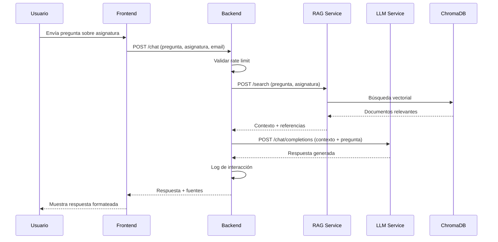

# Chatbot IA CEPRUD 🤖

<div align="center">

[](https://www.python.org/downloads/)
[](https://fastapi.tiangolo.com/)
[](https://react.dev/)
[](https://www.typescriptlang.org/)
[](LICENSE)
[](https://www.imsglobal.org/spec/lti/v1p3/)

**Sistema de chatbot educativo avanzado basado en Inteligencia Artificial para CEPRUD**  
*(Centro de Producción de Recursos para la Universidad Digital)*

[🚀 Inicio Rápido](#-inicio-rápido) •
[📚 Documentación](#-documentación) •
[🏗️ Arquitectura](#️-arquitectura) •
[🎓 Características](#-características-principales) •
[🤝 Contribuir](#-contribuir)

</div>

---

## 📋 Tabla de Contenidos

- [Acerca del Proyecto](#-acerca-del-proyecto)
- [Características Principales](#-características-principales)
- [Arquitectura](#️-arquitectura)
- [Tecnologías](#-tecnologías)
- [Requisitos](#-requisitos)
- [Inicio Rápido](#-inicio-rápido)
- [Documentación](#-documentación)
- [Casos de Uso](#-casos-de-uso)
- [Capturas de Pantalla](#-capturas-de-pantalla)
- [Desarrollo](#-desarrollo)
- [Testing](#-testing)
- [Despliegue](#-despliegue)
- [Roadmap](#-roadmap)
- [Contribuir](#-contribuir)
- [Licencia](#-licencia)
- [Contacto](#-contacto)
- [Agradecimientos](#-agradecimientos)

---

## ⚡ Quick setup

Sigue estos pasos mínimos para arrancar el proyecto en modo desarrollo de forma rápida.

1. Clonar el repositorio

```bash
git clone https://github.com/GabrielFranciscoSM/Chatbot_IA_Ceprud.git
cd Chatbot_IA_Ceprud
```

2. Desplegar contenedores

```bash
podman network create chatbot-network
```

```bash
podman-compose -f chatbot-compose.yml up -d
```

Accede posteriormente a:

- Frontend: http://localhost:8090
- API docs: http://localhost:8080/docs

## 🎓 Acerca del Proyecto

**Chatbot IA CEPRUD** es una solución educativa de vanguardia que utiliza técnicas avanzadas de Inteligencia Artificial para proporcionar asistencia personalizada a estudiantes de Ingeniería Informática de la Universidad de Granada.

### ¿Qué hace este proyecto?

El sistema implementa un chatbot inteligente que:
- 💬 **Responde preguntas** sobre asignaturas usando información oficial de guías docentes
- 🔍 **Utiliza RAG** (Retrieval-Augmented Generation) para respuestas precisas y contextualizadas
- 🎓 **Se integra con Moodle** mediante el estándar LTI 1.3 para acceso transparente
- 👤 **Personaliza la experiencia** permitiendo a cada usuario gestionar sus asignaturas
- 📊 **Genera analíticas** sobre patrones de aprendizaje y uso del sistema

### ¿Por qué es importante?

- **Acceso 24/7**: Los estudiantes obtienen ayuda en cualquier momento sin depender de horarios de atención
- **Escalabilidad**: Puede atender a múltiples usuarios simultáneamente sin degradación del servicio
- **Precisión**: Las respuestas están basadas en documentación oficial verificada
- **Trazabilidad**: Todas las respuestas incluyen referencias a sus fuentes
- **Innovación Educativa**: Demuestra cómo la IA puede mejorar el proceso de aprendizaje

---

## 🎯 Características Principales

### 🎓 Integración LTI 1.3 con Moodle

Integración completa y segura con plataformas de aprendizaje Moodle:

- ✅ **Autenticación OIDC** con validación JWT criptográfica
- ✅ **Lanzamiento contextual** desde actividades del curso
- ✅ **Sesiones persistentes** respaldadas por MongoDB
- ✅ **Mapeo automático** de cursos a asignaturas del chatbot
- ✅ **Soporte iframe** con headers de seguridad apropiados
- ✅ **Sincronización de usuarios** automática desde Moodle

### 💬 Interface Frontend Moderna

Aplicación web React TypeScript con experiencia de usuario excepcional:

- 🎨 **Diseño intuitivo y responsivo** para desktop y móviles
- 🔍 **Búsqueda inteligente** de asignaturas disponibles
- 👤 **Gestión personalizada** de asignaturas por usuario
- 💬 **Chat en tiempo real** con historial persistente
- ⚡ **Indicadores visuales** de límites de uso (rate limiting)
- 📱 **PWA-ready** para instalación como aplicación

### 🏗️ Arquitectura de Microservicios

Sistema modular, escalable y mantenible:

| Servicio | Puerto | Descripción |
|----------|--------|-------------|
| **Backend API** | 8080 | Orquestación y lógica de negocio principal |
| **RAG Service** | 8082 | Recuperación de información y embeddings |
| **User Service** | 8083 | Gestión de usuarios con MongoDB |
| **Logging Service** | 8002 | Analíticas y eventos de aprendizaje |
| **Frontend** | 8090 | Aplicación web React |
| **MongoDB** | 27017 | Base de datos de usuarios |

### 🔍 Sistema RAG Avanzado

Tecnología de Retrieval-Augmented Generation de última generación:

- 🧠 **ChromaDB** como base de datos vectorial optimizada
- 📊 **Embeddings semánticos** con modelos state-of-the-art (Qwen3-Embedding)
- 📚 **Procesamiento automático** de guías docentes
- 🎯 **Búsqueda contextual** precisa y relevante
- 🔗 **Referencias verificables** a documentos fuente

### 🤖 Machine Learning Optimizado

Modelos de lenguaje grandes adaptados al dominio educativo:

- 🚀 **vLLM** para inferencia optimizada con GPU
- 💡 **Phi-3-mini-4k-instruct-AWQ** cuantizado para eficiencia
- 🎓 **Fine-tuning con QLoRA** para personalización al dominio
- 📈 **Evaluación continua** de calidad de respuestas

### 📊 Monitoreo y Observabilidad

Sistema completo de métricas y analíticas:

- 📝 **Logging estructurado** en JSON
- 🔍 **Trazabilidad completa** de requests
- **Langfuse** para monitorización del agente

---

## 🏗️ Arquitectura

### Vista General del Sistema

```
┌─────────────────────────────────────────────────────────────────┐
│                       FRONTEND LAYER                            │
│  ┌──────────────────────────────────────────────────────────┐   │
│  │  React 18 + TypeScript + Vite                            │   │
│  │  • Chat Interface  • Subject Management  • Session Auth  │   │
│  └──────────────────────────────────────────────────────────┘   │
└───────────────────────────┬─────────────────────────────────────┘
                            │ HTTPS/REST API
┌───────────────────────────▼─────────────────────────────────────┐
│                    BACKEND API GATEWAY                          │
│  ┌──────────────────────────────────────────────────────────┐   │
│  │  FastAPI + Python 3.10                                   │   │
│  │  • LTI 1.3 Integration  • Rate Limiting  • Sessions      │   │
│  │  • Request Orchestration  • Business Logic               │   │
│  └──────────────────────────────────────────────────────────┘   │
└─┬────────────┬────────────┬────────────┬────────────┬───────────┘
  │            │            │            │            │
  ▼            ▼            ▼            ▼            ▼
┌──────────┐ ┌──────────┐ ┌──────────┐ ┌──────────┐ ┌──────────┐
│   RAG    │ │   User   │ │ Logging  │ │   LLM    │ │Embedding │
│ Service  │ │ Service  │ │ Service  │ │ (vLLM)   │ │ Service  │
│          │ │          │ │          │ │          │ │          │
│ Port     │ │ Port     │ │ Port     │ │ Port     │ │ Port     │
│ 8082     │ │ 8083     │ │ 8002     │ │ 8000     │ │ 8001     │
└────┬─────┘ └────┬─────┘ └────┬─────┘ └──────────┘ └──────────┘
     │            │            │
     ▼            ▼            ▼
┌─────────┐  ┌─────────┐  ┌─────────┐
│ChromaDB │  │ MongoDB │  │  Logs   │
│Vectores │  │ Usuarios│  │ CSV/JSON│
└─────────┘  └─────────┘  └─────────┘
```

### Flujo de Datos Principal



### Componentes Principales

#### 🔧 Backend Service (FastAPI)
**Responsabilidades:**
- Orquestación de requests entre servicios
- Validación de entrada y rate limiting
- Gestión de sesiones (SQLite y MongoDB)
- Integración LTI 1.3 con Moodle
- Lógica de negocio del chatbot

#### 🔍 RAG Service
**Responsabilidades:**
- Gestión de ChromaDB (base de datos vectorial)
- Búsqueda semántica de documentos
- Procesamiento de guías docentes
- Generación de embeddings
- Extracción de contexto relevante

#### 👤 User Service (MongoDB)
**Responsabilidades:**
- CRUD de usuarios
- Gestión de asignaturas por usuario
- Autenticación basada en email
- Sincronización con datos LTI

#### 📊 Logging Service
**Responsabilidades:**
- Recolección de eventos de aprendizaje
- Generación de métricas de uso
- Almacenamiento de analíticas
- Exportación de datos

---

## 🛠️ Tecnologías

### Backend
-  **Python 3.10+** - Lenguaje principal
-  **FastAPI** - Framework web moderno
-  **Pydantic** - Validación de datos

### Frontend
-  **React 18** - Framework UI
-  **TypeScript** - Superset de JavaScript
-  **Vite** - Build tool moderno

### AI/ML
-  **Transformers** - Modelos pre-entrenados
- **vLLM** - Optimización de inferencia LLM
- **ChromaDB** - Base de datos vectorial
- **Sentence Transformers** - Embeddings semánticos

### Bases de Datos
-  **MongoDB** - Base de datos de usuarios
- **ChromaDB** - Base de datos vectorial para RAG
- **SQLite** - Sesiones locales

### Infraestructura
-  **Podman** - Containerización

### Integración
- **LTI 1.3** - Integración con Moodle
- **OIDC/OAuth 2.0** - Autenticación
- **JWT** - Validación de tokens

---

## 📦 Requisitos

### Requisitos Mínimos

| Componente | Especificación |
|------------|----------------|
| **OS** | Linux (Ubuntu 20.04+, CentOS 8+) |
| **RAM** | 8 GB |
| **CPU** | 4 cores |
| **Almacenamiento** | 20 GB libres |
| **Docker** | 20.10+ |
| **Docker Compose** | 2.0+ |

### Requisitos Recomendados

| Componente | Especificación |
|------------|----------------|
| **RAM** | 16+ GB |
| **CPU** | 8+ cores |
| **GPU** | NVIDIA 8+ GB VRAM (RTX 3060, RTX 4060) |
| **CUDA** | 11.8+ o 12.0+ |
| **Almacenamiento** | 50+ GB SSD |

### Software Necesario

```bash
# Verificar versiones instaladas
podman --version          # >= 20.10
podman-compose --version  # >= 2.0
python --version          # >= 3.10
nvidia-smi               # Para GPU (opcional)
```

---

## 🚀 Inicio Rápido

### 1️⃣ Clonar el Repositorio

```bash
git clone https://github.com/GabrielFranciscoSM/Chatbot_IA_Ceprud.git
cd Chatbot_IA_Ceprud
```

### 2️⃣ Configurar Variables de Entorno

```bash
# Crear archivo de configuración
cp .env.example .env

# Editar con tus credenciales
nano .env
```

**Configuración mínima requerida:**

```bash
# Token de Hugging Face (obtener en https://huggingface.co/settings/tokens)
HF_TOKEN=your_huggingface_token_here

# URLs de servicios (usar valores por defecto para desarrollo local)
RAG_SERVICE_URL=http://localhost:8082
LOGGING_SERVICE_URL=http://localhost:8002
USER_SERVICE_URL=http://localhost:8083
VLLM_LLM_URL=http://localhost:8000
VLLM_EMBEDDING_URL=http://localhost:8001

# Configuración LTI (si usas integración con Moodle)
MOODLE_ISSUER=https://your-moodle-instance.com
MOODLE_CLIENT_ID=your_client_id
CHATBOT_BASE_URL=https://your-chatbot-domain.com
```

### 3️⃣ Descargar Modelos de IA

```bash
# Instalar dependencias para descarga
pip install huggingface_hub

# Descargar modelos (Phi-3-mini y Qwen-Embeddings)
python scripts/download_llm.py
```

**Modelos descargados:**
- 🤖 **LLM**: `Sreenington/Phi-3-mini-4k-instruct-AWQ` (~2GB)
- 📊 **Embeddings**: `Qwen/Qwen3-Embedding-0.6B` (~1.2GB)

### 4️⃣ Levantar los Servicios

```bash
# Construir y levantar todos los servicios
podman-compose -f docker-compose-full.yml up --build -d

# Verificar que todos los servicios estén corriendo
podman-compose -f docker-compose-full.yml ps
```

### 5️⃣ Verificar la Instalación

```bash
# Health checks de servicios
curl http://localhost:8080/health  # Backend
curl http://localhost:8082/health  # RAG Service
curl http://localhost:8083/health  # User Service
```

### 6️⃣ Acceder a la Aplicación

| Servicio | URL | Credenciales |
|----------|-----|--------------|
| **Frontend** | http://localhost:8090 | - |
| **API Docs** | http://localhost:8080/docs | - |
| **Mongo Express** | http://localhost:8081 | user: `mongoexpressuser`<br>pass: `mongoexpresspass` |

---

## 📚 Documentación

### 📖 Documentación Completa

Toda la documentación está disponible en el directorio [`docs/`](docs/):

| Documento | Descripción |
|-----------|-------------|
| [📋 Índice de Documentación](docs/README.md) | Navegación completa de toda la documentación |
| [🎯 Visión General del Proyecto](docs/PROJECT_OVERVIEW.md) | Objetivos, decisiones técnicas y contexto |
| [🏗️ Arquitectura del Sistema](docs/ARCHITECTURE.md) | Diseño técnico detallado y diagramas |
| [📦 Guía de Instalación](docs/INSTALLATION.md) | Instalación paso a paso y configuración |
| [👨‍💻 Guía de Desarrollo](docs/DEVELOPMENT.md) | Setup del entorno de desarrollo |
| [🔌 Documentación de API](docs/API.md) | Referencia completa de endpoints REST |
| [🎓 Integración LTI 1.3](docs/LTI_INTEGRATION.md) | Configuración con Moodle |
| [💾 Integración MongoDB](docs/MONGODB_INTEGRATION.md) | Gestión de usuarios y datos |
| [🧪 Guía de Testing](docs/TESTING.md) | Estrategias y ejecución de tests |
| [📈 Configuración de Monitoreo](docs/MONITORING.md) | langfuse y métricas |
| [🔐 Autenticación](docs/AUTHENTICATION_IMPLEMENTATION.md) | Implementación de autenticación |

### 🎥 Guías Rápidas

#### Para Usuarios Finales
- [📘 Guía de Usuario](user-guide.md) - Cómo usar el chatbot efectivamente

#### Para Desarrolladores
1. Lee [ARCHITECTURE.md](docs/ARCHITECTURE.md) para entender el diseño
2. Sigue [DEVELOPMENT.md](docs/DEVELOPMENT.md) para configurar tu entorno
3. Consulta [API.md](docs/API.md) para entender los endpoints
4. Revisa [TESTING.md](docs/TESTING.md) para escribir tests

#### Para Administradores
1. Estudia [INSTALLATION.md](docs/INSTALLATION.md) para requisitos
2. Revisa [ARCHITECTURE.md](docs/ARCHITECTURE.md) para dependencias
3. Configura [MONITORING.md](docs/MONITORING.md) para observabilidad
4. Si integras con Moodle, lee [LTI_INTEGRATION.md](docs/LTI_INTEGRATION.md)

### 📊 Diagramas

Todos los diagramas técnicos están en [`docs/diagrams/`](docs/diagrams/):
- Arquitectura del sistema
- Flujos de datos
- Deployment
- Monitoreo

---

## 💼 Casos de Uso

### 👨‍🎓 Para Estudiantes

- ✅ **Consultas 24/7** sobre contenido de asignaturas
- ✅ **Aclaración de conceptos** difíciles del temario
- ✅ **Información rápida** sobre evaluación y requisitos
- ✅ **Estudio autodirigido** con asistencia IA personalizada
- ✅ **Acceso desde Moodle** sin autenticación adicional

### 👨‍🏫 Para Profesores

- ✅ **Reducción de consultas repetitivas** básicas
- ✅ **Insights sobre temas problemáticos** más consultados
- ✅ **Estandarización de información** proporcionada
- ✅ **Liberación de tiempo** para consultas más complejas
- ✅ **Analytics de aprendizaje** de los estudiantes

### 🏛️ Para Instituciones

- ✅ **Mejora en satisfacción estudiantil**
- ✅ **Innovación tecnológica** visible
- ✅ **Datos valiosos** sobre patrones de aprendizaje
- ✅ **Escalabilidad** del soporte educativo
- ✅ **Reducción de carga** en servicios de atención

---

## 💻 Desarrollo

### Configurar Entorno de Desarrollo

```bash
# Clonar repositorio
git clone https://github.com/GabrielFranciscoSM/Chatbot_IA_Ceprud.git
cd Chatbot_IA_Ceprud

# Crear entorno virtual Python
python -m venv venv
source venv/bin/activate  # Linux/Mac
# venv\Scripts\activate  # Windows

# Instalar dependencias backend
pip install -r requirements.txt

# Instalar dependencias frontend
cd frontend
npm install
cd ..

# Configurar pre-commit hooks
pip install pre-commit
pre-commit install
```

### Ejecutar en Modo Desarrollo

**Backend:**
```bash
# Desde el directorio raíz
uvicorn app.app:app --reload --port 8080
```

**Frontend:**
```bash
cd frontend
npm run dev
```

**Servicios auxiliares:**
```bash
# Solo servicios de infraestructura (MongoDB, RAG)
podman-compose -f docker-compose-full.yml up -d mongodb user-service rag-service
```

### Estructura del Código

```
Chatbot_IA_Ceprud/
├── app/                      # Backend FastAPI
│   ├── core/                 # Configuración y modelos base
│   ├── domain/               # Lógica de dominio
│   ├── routes/               # Endpoints REST
│   ├── services/             # Servicios de negocio
│   └── lti/                  # Integración LTI 1.3
├── frontend/                 # Frontend React
│   └── src/
│       ├── components/       # Componentes React
│       ├── contexts/         # Context providers
│       └── types.ts          # Definiciones TypeScript
├── rag-service/              # Servicio RAG
│   └── app/
│       ├── main.py          # API RAG
│       └── rag_manager.py   # Gestión ChromaDB
├── mongo-service/            # Servicio de usuarios
│   └── app/
│       ├── main.py          # API MongoDB
│       └── models.py        # Modelos de usuario
├── logging-service/          # Servicio de logging
├── tests/                    # Tests de integración
├── unitTests/                # Tests unitarios
└── docs/                     # Documentación
```

---

## 🧪 Testing

### Ejecutar Tests

```bash
# Tests unitarios
pytest unitTests/ -v

# Tests de integración
pytest tests/integration/ -v

# Tests end-to-end
pytest tests/e2e/ -v

# Tests con coverage
pytest --cov=app --cov-report=html
```

### Tests Disponibles

- ✅ **Unitarios**: Lógica de negocio, embeddings, RAG
- ✅ **Integración**: Comunicación entre servicios
- ✅ **E2E**: Flujos completos de usuario
- ✅ **Infraestructura**: Health checks, conectividad

Ver [TESTING.md](docs/TESTING.md) para más detalles.

---

## 🚢 Despliegue

### Despliegue con Docker Compose

**Producción completa:**
```bash
podman-compose -f docker-compose-full.yml up -d
```

**Solo servicios específicos:**
```bash
podman-compose -f docker-compose-full.yml up -d backend frontend rag-service user-service
```

### Despliegue con GPU

Habilitar vLLM para aceleración GPU:

1. Descomentar servicios vLLM en `docker-compose-full.yml`
2. Configurar `LOCAL_INFERENCE=false` en variables de entorno
3. Levantar servicios:

```bash
podman-compose -f docker-compose-full.yml up -d vllm-openai vllm-openai-embeddings
```

### Despliegue en Producción

Ver [INSTALLATION.md](docs/INSTALLATION.md) para guías detalladas de:
- Configuración de HTTPS con Nginx
- SSL/TLS con Let's Encrypt
- Cloudflare Tunnel para desarrollo
- Configuración de reverse proxy

---

## 🗺️ Roadmap

### ✅ Versión 1.0 (Completado)
- [x] Sistema RAG básico
- [x] Backend API con FastAPI
- [x] Frontend React básico
- [x] Integración con ChromaDB
- [x] Documentación inicial

### ✅ Versión 2.0 (Completado)
- [x] Integración LTI 1.3 con Moodle
- [x] Gestión de usuarios con MongoDB
- [x] Sistema de sesiones persistentes
- [x] Frontend mejorado con TypeScript
- [x] Búsqueda de asignaturas

### ✅ Versión 3.0 (Actual)
- [x] Optimización vLLM
- [x] Monitoreo con langfuse
- [x] Documentación completa

---

## 🤝 Contribuir

¡Las contribuciones son bienvenidas! Este proyecto mejora gracias a la comunidad.

### Cómo Contribuir

1. **Fork** el proyecto
2. **Crea una rama** para tu feature (`git checkout -b feature/AmazingFeature`)
3. **Commit** tus cambios (`git commit -m 'Add some AmazingFeature'`)
4. **Push** a la rama (`git push origin feature/AmazingFeature`)
5. **Abre un Pull Request**

### Guías de Contribución

- Lee [DEVELOPMENT.md](docs/DEVELOPMENT.md) para configurar tu entorno
- Sigue las convenciones de código del proyecto
- Añade tests para nuevas funcionalidades
- Actualiza documentación cuando sea necesario
- Asegúrate que los tests pasen antes de hacer PR

### Reportar Bugs

Usa [GitHub Issues](https://github.com/GabrielFranciscoSM/Chatbot_IA_Ceprud/issues) con:
- Descripción clara del problema
- Pasos para reproducir
- Comportamiento esperado vs actual
- Screenshots (si aplica)
- Logs relevantes

### Solicitar Features

Abre un [GitHub Issue](https://github.com/GabrielFranciscoSM/Chatbot_IA_Ceprud/issues) describiendo:
- El problema que resuelve
- Solución propuesta
- Alternativas consideradas
- Contexto adicional

---

## 📄 Licencia

Este proyecto está bajo la licencia **MIT**. Ver [LICENSE](LICENSE) para más detalles.

---

## 📧 Contacto

### Desarrolladores Principales

**Javier Trujillo Castro**
- 🎓 Desarrollo inicial
- 📧 Email: [contacto en GitHub]
- 💼 LinkedIn: [perfil]

**Gabriel Sánchez Muñoz**
- 🎓 Visualización de métricas, vLLM y refactorización
- 🐙 GitHub: [@GabrielFranciscoSM](https://github.com/GabrielFranciscoSM)

### Institución

**CEPRUD - Universidad de Granada**
- 🏛️ Centro de Producción de Recursos para la Universidad Digital
- 🌐 Web: [UGR](https://www.ugr.es)

### Soporte

- 📧 **Email**: Crea un [issue en GitHub](https://github.com/GabrielFranciscoSM/Chatbot_IA_Ceprud/issues)
- 💬 **Discusiones**: [GitHub Discussions](https://github.com/GabrielFranciscoSM/Chatbot_IA_Ceprud/discussions)
- 📚 **Documentación**: [docs/](docs/)
- 🐛 **Bugs**: [GitHub Issues](https://github.com/GabrielFranciscoSM/Chatbot_IA_Ceprud/issues)

---

## 🙏 Agradecimientos

Este proyecto no sería posible sin:

- **CEPRUD & Universidad de Granada** - Por el apoyo institucional y recursos
- **Hugging Face** - Por los modelos pre-entrenados y la plataforma
- **FastAPI Team** - Por el excelente framework web
- **React Team** - Por la librería UI moderna
- **vLLM Project** - Por la optimización de inferencia LLM
- **ChromaDB Team** - Por la base de datos vectorial
- **MongoDB Team** - Por la base de datos robusta
- **IMS Global** - Por el estándar LTI 1.3
- **Comunidad Open Source** - Por todas las librerías y herramientas utilizadas

### Tecnologías Open Source Utilizadas

- Python, FastAPI, Pydantic, Uvicorn
- React, TypeScript, Vite, Axios
- PyTorch, Transformers, Sentence Transformers
- ChromaDB, MongoDB, SQLite
- Docker, Nginx
- Y muchas más... 🙏

---

## 📊 Estadísticas del Proyecto


---

<div align="center">

### ⭐ Si este proyecto te resultó útil, considera darle una estrella ⭐

**Hecho con ❤️ por el equipo de CEPRUD**

[🚀 Volver arriba](#chatbot-ia-ceprud-)

</div>
