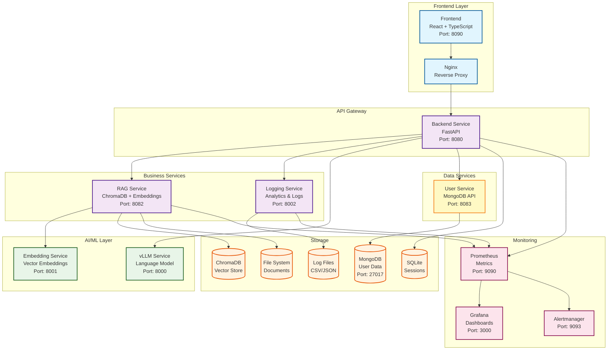

# Arquitectura del Sistema - Chatbot IA CEPRUD

## 🏗️ Visión General de la Arquitectura

El proyecto Chatbot IA CEPRUD está diseñado como un sistema de microservicios distribuidos que implementa una arquitectura orientada a servicios (SOA) moderna. La solución combina inteligencia artificial, técnicas RAG (Retrieval-Augmented Generation), y monitoreo avanzado para crear un chatbot educativo escalable y mantenible.

## 📐 Principios de Arquitectura

### 1. **Separación de Responsabilidades**
- Cada microservicio tiene una responsabilidad específica y bien definida
- Bajo acoplamiento entre servicios
- Alta cohesión dentro de cada servicio

### 2. **Escalabilidad Horizontal**
- Servicios containerizados con Docker
- Posibilidad de escalar independientemente cada servicio
- Load balancing preparado para múltiples instancias

### 3. **Observabilidad**
- Logging estructurado en todos los servicios
- Métricas con Prometheus
- Visualización con Grafana
- Trazabilidad de requests entre servicios

### 4. **Tolerancia a Fallos**
- Health checks en todos los servicios
- Graceful degradation
- Circuit breaker patterns donde aplica

## 🏛️ Arquitectura de Microservicios



## 🔧 Servicios y Responsabilidades

### 1. **Backend Service** (Puerto 8080)
**Tecnologías**: FastAPI, Python 3.10+
**Responsabilidades**:
- Orquestación de requests del usuario
- Lógica de negocio del chatbot
- Rate limiting y validación
- Gestión de sesiones de usuario
- Coordinación entre microservicios
- API REST principal

**Endpoints Principales**:
- `POST /chat` - Procesamiento de mensajes del chat
- `GET /subjects` - Lista de asignaturas disponibles
- `POST /sessions` - Gestión de sesiones
- `POST /user/create` - Creación de usuarios
- `GET /user/profile` - Perfil de usuario
- `GET /user/subjects` - Asignaturas del usuario
- `POST /user/subjects` - Añadir asignatura
- `DELETE /user/subjects/{id}` - Eliminar asignatura
- `GET /health` - Health check

### 2. **RAG Service** (Puerto 8082)
**Tecnologías**: FastAPI, ChromaDB, Sentence Transformers
**Responsabilidades**:
- Gestión de la base de datos vectorial (ChromaDB)
- Búsqueda semántica de documentos
- Procesamiento de documentos
- Extracción de guías docentes
- Gestión de embeddings

**Endpoints Principales**:
- `POST /search` - Búsqueda semántica
- `POST /populate` - Población de base de datos
- `POST /upload` - Subida de documentos
- `GET /subjects` - Asignaturas disponibles

### 3. **Logging Service** (Puerto 8002)
**Tecnologías**: FastAPI, CSV/JSON processing
**Responsabilidades**:
- Recolección y almacenamiento de logs
- Analytics de aprendizaje
- Generación de métricas
- Exportación de datos para análisis

**Endpoints Principales**:
- `POST /log/interaction` - Log de interacciones
- `POST /log/session` - Log de sesiones
- `GET /analytics` - Datos analíticos
- `GET /metrics` - Métricas del sistema

### 4. **User Service** (Puerto 8083)
**Tecnologías**: FastAPI, Motor (MongoDB async driver)
**Responsabilidades**:
- Gestión de usuarios (CRUD)
- Autenticación basada en email
- Gestión de asignaturas por usuario
- Persistencia en MongoDB
- Validación de datos con Pydantic

**Endpoints Principales**:
- `POST /users` - Crear usuario
- `GET /users/email/{email}` - Obtener usuario
- `PUT /users/{id}` - Actualizar usuario
- `GET /users/{id}/subjects` - Obtener asignaturas del usuario
- `POST /users/email/{email}/subjects` - Añadir asignatura
- `DELETE /users/email/{email}/subjects/{id}` - Eliminar asignatura

**Base de Datos**:
- MongoDB con colección `users`
- Índice único en campo `email`
- Volumen persistente para datos

### 5. **Frontend Service** (Puerto 8090)
**Tecnologías**: React, TypeScript, Vite, Nginx
**Responsabilidades**:
- Interfaz de usuario moderna y responsiva
- Gestión de estado del chat
- Comunicación con backend via API REST
- Experiencia de usuario optimizada
- Búsqueda y gestión de asignaturas

**Características**:
- Chat en tiempo real
- Búsqueda de asignaturas disponibles
- Gestión personalizada de asignaturas por usuario
- Historial de conversaciones
- Responsive design
- PWA capabilities

### 6. **LLM Services** (Puertos 8000-8001)
**Tecnologías**: vLLM, CUDA, Transformers
**Responsabilidades**:
- Servicio de modelos de lenguaje (LLM)
- Servicio de embeddings
- Optimización GPU con vLLM
- API compatible con OpenAI

## 🗂️ Estructura de Directorios Detallada

```
Chatbot_IA_Ceprud/
├── 🌐 frontend/                    # Frontend React + TypeScript
│   ├── src/
│   │   ├── components/             # Componentes React reutilizables
│   │   │   ├── SubjectSearch.tsx  # Búsqueda de asignaturas
│   │   │   ├── SubjectSidebar.tsx # Lista de asignaturas del usuario
│   │   │   └── ...                # Otros componentes
│   │   ├── types.ts               # Definiciones TypeScript
│   │   ├── api.ts                 # Cliente API (incluye subject mgmt)
│   │   └── utils.ts               # Utilidades frontend
│   ├── Dockerfile                 # Container frontend
│   └── nginx.conf                 # Configuración Nginx
│
├── 🚀 app/                        # Backend Service
│   ├── api_router.py              # Rutas API principales
│   ├── app.py                     # Aplicación FastAPI
│   │
│   ├── 🔧 core/                   # Infraestructura base
│   │   ├── config.py              # Configuración centralizada
│   │   ├── models.py              # Modelos Pydantic
│   │   └── rate_limiter.py        # Control de rate limiting
│   │
│   ├── 🎯 services/               # Servicios de negocio
│   │   ├── session_service.py     # Gestión de sesiones
│   │   ├── logging_service.py     # Cliente logging
│   │   ├── rag_client.py          # Cliente RAG
│   │   ├── user_service.py        # Cliente User Service (MongoDB)
│   │   └── utils_service.py       # Utilidades comunes
│   │
│   ├── 🧠 domain/                 # Lógica de dominio
│   │   ├── query_logic.py         # Procesamiento consultas
│   │   └── graph.py               # Operaciones con grafos
│   │
│   └── 💾 storage/                # Almacenamiento local
│       └── checkpoints.sqlite
│
├── 🔍 rag-service/                # RAG Service
│   ├── app/
│   │   ├── main.py               # API RAG
│   │   ├── rag_manager.py        # Gestor RAG
│   │   ├── document_processor.py # Procesador documentos
│   │   ├── embeddings.py         # Gestión embeddings
│   │   └── guia_docente_scrapper.py # Scraping guías
│   └── data/                     # Documentos y ChromaDB
│
├── 📊 logging-service/           # Logging Service
│   ├── app/
│   │   ├── main.py              # API Logging
│   │   ├── routers/             # Rutas logging
│   │   └── core/                # Configuración logging
│   └── logs/                    # Archivos de log
│
├── 👤 mongo-service/             # User Service (MongoDB)
│   ├── app/
│   │   ├── main.py              # API User Service
│   │   ├── models.py            # Modelos usuario (con subjects)
│   │   └── database.py          # Conexión MongoDB
│   ├── Dockerfile               # Container user service
│   └── requirements.txt         # Dependencias Python
│
├── 🧪 tests/                     # Tests de integración
│   ├── e2e/                     # Tests end-to-end
│   ├── integration/             # Tests integración
│   └── infrastructure/          # Tests infraestructura
│
├── 🔬 unitTests/                 # Tests unitarios backend
│   ├── test_query_logic.py      # Tests lógica consultas
│   ├── test_embeddings.py       # Tests embeddings
│   └── test_graph.py            # Tests grafos
│
├── 📈 prometheus/                # Monitoreo
│   ├── prometheus.yml           # Configuración Prometheus
│   ├── grafana.json            # Dashboard Grafana
│   └── docker-compose-prometheus-graphana.yml
│
└── 🐳 Containerización
    ├── docker-compose-full.yml  # Stack completo
    ├── Containerfile           # Backend container
    └── .env                    # Variables entorno
```

## 🔄 Flujo de Datos

### 1. **Flujo de Chat Standard**
```
Usuario → Frontend → Backend → RAG Service → ChromaDB
                  ↓           ↓
             Logging Service → LLM Service
                  ↓           ↓
               Log Files ← Response → Usuario
```

### 2. **Flujo de Gestión de Asignaturas**
```
Usuario busca → Frontend (SubjectSearch) → Backend API
                                              ↓
                                         User Service
                                              ↓
Usuario selecciona → Add Subject → MongoDB (update subjects array)
                                              ↓
                                         Return subjects
                                              ↓
Frontend actualiza lista ← Backend ← User Service
```

### 3. **Flujo de Población de Datos**
```
Documentos → RAG Service → Document Processor → Embeddings Service
                ↓                                      ↓
           ChromaDB ← Vector Embeddings ←――――――――――――――┘
```

### 4. **Flujo de Monitoreo**
```
Servicios → Prometheus → Grafana → Dashboard
     ↓
  Log Files → Logging Service → Analytics
```

## 🛠️ Tecnologías por Capa

### **Frontend**
- **React 18**: Framework UI
- **TypeScript**: Tipado estático
- **Vite**: Build tool moderno
- **Axios**: Cliente HTTP
- **Lucide React**: Iconografía
- **Nginx**: Servidor web

### **Backend**
- **FastAPI**: Framework API
- **Pydantic**: Validación de datos
- **Asyncio**: Programación asíncrona
- **SQLite**: Almacenamiento local sesiones
- **MongoDB**: Base de datos usuarios (Motor driver)
- **Prometheus Client**: Métricas
- **httpx**: Cliente HTTP asíncrono

### **RAG & AI**
- **ChromaDB**: Base de datos vectorial
- **Sentence Transformers**: Embeddings
- **vLLM**: Optimización inferencia
- **Hugging Face**: Modelos pre-entrenados
- **PyTorch**: Framework ML

### **Observabilidad**
- **Prometheus**: Recolección métricas
- **Grafana**: Visualización
- **Structured Logging**: Logs JSON
- **CSV Analytics**: Análisis datos

### **Infraestructura**
- **Docker**: Containerización
- **Docker Compose**: Orquestación
- **CUDA**: Aceleración GPU
- **Linux**: Sistema operativo

## 🔒 Consideraciones de Seguridad

### **Autenticación y Autorización**
- Rate limiting por IP/usuario
- Validación de entrada estricta
- CORS configurado correctamente

### **Datos Sensibles**
- Variables de entorno para secretos
- Logs anonimizados
- Sanitización de inputs


## 📊 Métricas y Observabilidad

### **Métricas de Negocio** TODO
- Número de interacciones por asignatura
- Tiempo de respuesta promedio
- Satisfacción del usuario
- Tasa de éxito de consultas

### **Métricas Técnicas** TODO
- CPU/Memory usage por servicio
- Latencia de requests
- Error rates
- Throughput del sistema

### **Logs Estructurados**
- Interacciones de chat
- Eventos de aprendizaje
- Sesiones de usuario
- Errores del sistema

Este documento proporciona una visión técnica completa de la arquitectura del sistema, facilitando el entendimiento, mantenimiento y evolución del proyecto.
