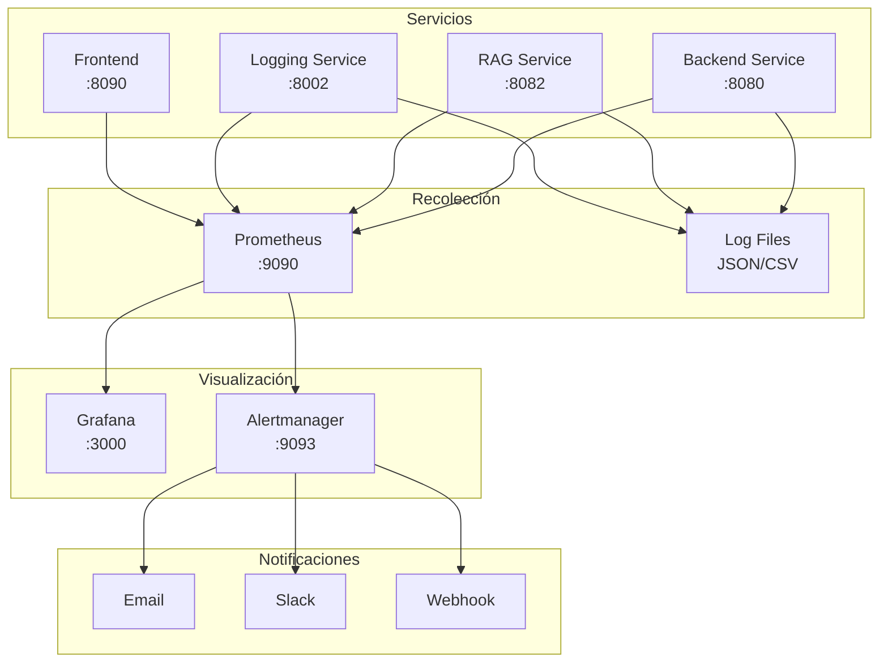

# Guía de Monitoreo - Chatbot IA CEPRUD

## 🎯 Introducción al Monitoreo

El sistema de monitoreo del Chatbot IA CEPRUD está diseñado para proporcionar observabilidad completa del stack de microservicios, permitiendo detectar problemas proactivamente, optimizar rendimiento y garantizar una experiencia de usuario óptima.

## 📊 Stack de Observabilidad

### **Componentes Principales**
- **Prometheus**: Recolección y almacenamiento de métricas
- **Grafana**: Visualización de métricas y dashboards
- **Logs estructurados**: Logging centralizado con formato JSON
- **Health checks**: Monitoreo de salud de servicios

### **Arquitectura de Monitoreo**



## 🚀 Configuración Rápida

### **Levantar Stack de Monitoreo**

```bash
# Levantar servicios de monitoreo
docker-compose -f prometheus/docker-compose-prometheus-graphana.yml up -d

# Verificar servicios
docker-compose -f prometheus/docker-compose-prometheus-graphana.yml ps

# Ver logs
docker-compose -f prometheus/docker-compose-prometheus-graphana.yml logs -f
```

### **URLs de Acceso**
- **Grafana**: http://localhost:3000 (admin/admin)
- **Prometheus**: http://localhost:9090
- **Alertmanager**: http://localhost:9093

## 📈 Métricas del Sistema

### **Métricas de Aplicación TODO**

#### **Métricas de Chat**
```python
# Métricas implementadas en el backend
chatbot_requests_total = Counter(
    'chatbot_requests_total',
    'Total number of chat requests',
    ['subject', 'status', 'user_type']
)

chatbot_response_time_seconds = Histogram(
    'chatbot_response_time_seconds',
    'Time spent processing chat requests',
    ['subject', 'endpoint']
)

chatbot_active_sessions = Gauge(
    'chatbot_active_sessions',
    'Number of active chat sessions',
    ['subject']
)

chatbot_rag_search_time = Histogram(
    'chatbot_rag_search_time_seconds',
    'Time spent on RAG searches',
    ['subject']
)
```

#### **Métricas de RAG Service**
```python
rag_documents_indexed = Gauge(
    'rag_documents_indexed_total',
    'Total number of documents indexed',
    ['subject', 'document_type']
)

rag_search_accuracy = Histogram(
    'rag_search_accuracy_score',
    'Accuracy score of RAG searches',
    ['subject']
)

rag_embedding_time = Histogram(
    'rag_embedding_time_seconds',
    'Time to generate embeddings',
    ['model']
)
```

#### **Métricas de Sistema**
```python
# Métricas automáticas de FastAPI
http_requests_total = Counter(
    'http_requests_total',
    'Total HTTP requests',
    ['method', 'endpoint', 'status_code']
)

http_request_duration_seconds = Histogram(
    'http_request_duration_seconds',
    'HTTP request duration',
    ['method', 'endpoint']
)

# Métricas de recursos
process_cpu_usage = Gauge('process_cpu_usage_percent', 'CPU usage percentage')
process_memory_usage = Gauge('process_memory_usage_bytes', 'Memory usage in bytes')
```

### **Configuración de Prometheus**

```yaml
# prometheus.yaml
global:
  scrape_interval: 5s
  evaluation_interval: 30s

scrape_configs:
  - job_name: vllm
    static_configs:
      - targets:
          - 'host.docker.internal:8001'
```

---

Este sistema de monitoreo proporciona observabilidad completa del Chatbot IA CEPRUD, permitiendo mantener alta disponibilidad y rendimiento óptimo mientras se obtienen insights valiosos sobre el uso y la efectividad educativa del sistema.
