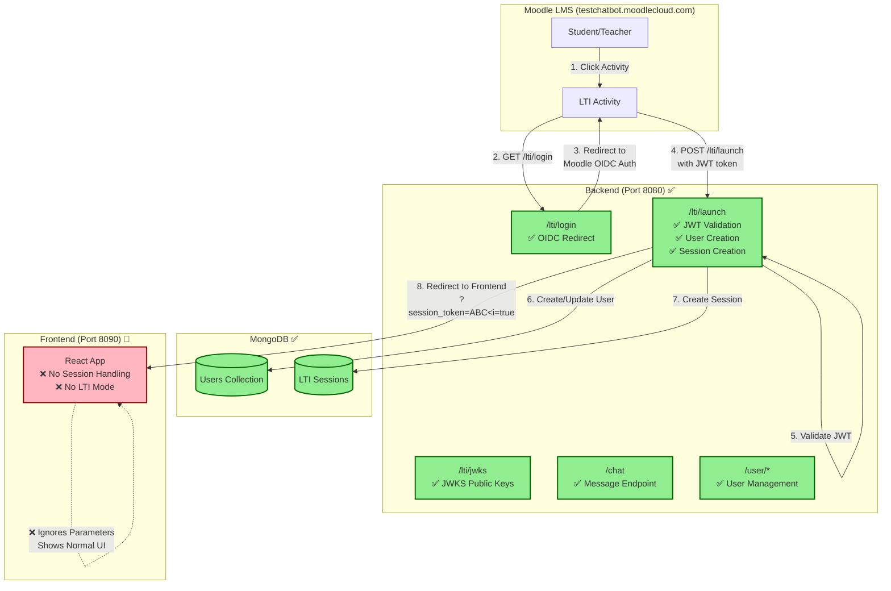
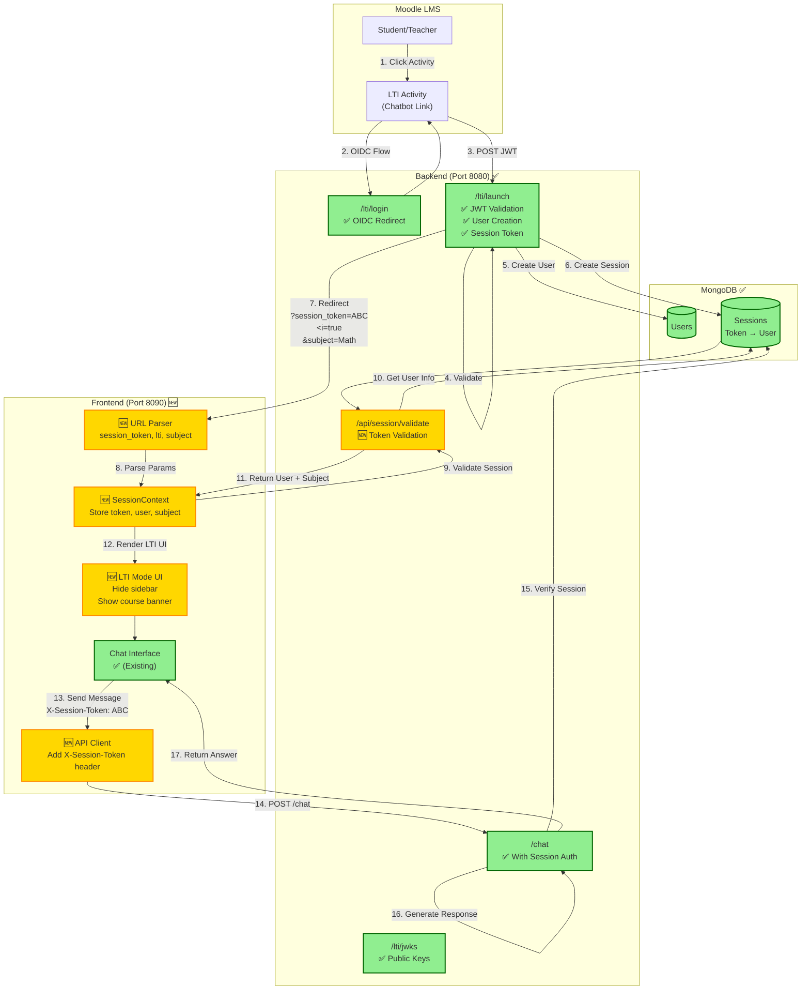

# LTI Integration Architecture - Current vs. Target

## 🎯 Current State (Phase 3 Complete)



**Current Problem**: Frontend receives `?session_token=ABC&lti=true&subject=Matematicas` but doesn't know what to do with it.

---

## 🚀 Target State (After Phase 4)



**Target Flow**: Complete end-to-end LTI integration with session-based authentication.

---

## 📊 Component Status Matrix

| Component | Current | Phase 4 | Status |
|-----------|---------|---------|--------|
| **JWKS Endpoint** | ✅ Working | ✅ No change | Ready |
| **OIDC Login** | ✅ Working | ✅ No change | Ready |
| **LTI Launch** | ✅ Working | ✅ No change | Ready |
| **JWT Validation** | ✅ Working | ✅ No change | Ready |
| **User Auto-Creation** | ✅ Working | ✅ No change | Ready |
| **Session Creation** | ✅ Working | ✅ No change | Ready |
| **URL Parameter Parsing** | ❌ Missing | 🆕 Add | TODO |
| **Session Context** | ❌ Missing | 🆕 Add | TODO |
| **Session Validation API** | ❌ Missing | 🆕 Add | TODO |
| **API Client Auth** | ❌ Missing | 🆕 Add | TODO |
| **LTI Mode UI** | ❌ Missing | 🆕 Add | TODO |
| **Chat Interface** | ✅ Working | ✅ Reuse | Ready |

---

## 🔄 Data Flow Comparison

### Current Flow (Incomplete)
```
Moodle User Click
    ↓
OIDC Authentication
    ↓
JWT Validation ✅
    ↓
User Created in DB ✅
    ↓
Session Created ✅
    ↓
Redirect to Frontend with session_token
    ↓
❌ Frontend ignores parameters
    ↓
❌ User sees normal login screen
```

### Target Flow (Complete)
```
Moodle User Click
    ↓
OIDC Authentication
    ↓
JWT Validation ✅
    ↓
User Created in DB ✅
    ↓
Session Token Generated ✅
    ↓
Redirect: /?session_token=ABC&lti=true&subject=Math
    ↓
🆕 Frontend parses URL
    ↓
🆕 Frontend validates session with backend
    ↓
🆕 Frontend receives user info + subject
    ↓
🆕 Frontend renders LTI mode (no sidebar)
    ↓
🆕 User sees chat interface for correct subject
    ↓
🆕 Messages sent with session token
    ↓
✅ User chats successfully in Moodle iframe
```

---

## 🗂️ File Structure Changes

### Before Phase 4
```
frontend/src/
├── App.tsx                 # Main component (no LTI awareness)
├── main.tsx                # Entry point (no URL parsing)
├── api.ts                  # API client (no session token)
├── components/
│   ├── ChatInput.tsx      ✅
│   ├── MessageList.tsx    ✅
│   ├── SubjectSidebar.tsx ✅ (always shown)
│   └── SettingsPanel.tsx  ✅ (always shown)
├── types.ts               ✅
├── constants.ts           ✅
└── utils.ts               ✅

app/
├── app.py                 ✅ LTI routes included
├── api_router.py          ✅ Chat/User endpoints
└── lti/
    ├── routes.py          ✅ JWKS, login, launch
    ├── config.py          ✅
    ├── models.py          ✅
    ├── jwt_validator.py   ✅
    ├── user_service.py    ✅
    └── session_service.py ✅
```

### After Phase 4
```
frontend/src/
├── App.tsx                      🔧 Add session context, conditional UI
├── main.tsx                     🔧 Parse URL params on mount
├── api.ts                       🔧 Add session token to headers
├── components/
│   ├── ChatInput.tsx           ✅ (no changes)
│   ├── MessageList.tsx         ✅ (no changes)
│   ├── SubjectSidebar.tsx      ✅ (conditionally hidden)
│   └── SettingsPanel.tsx       ✅ (conditionally hidden)
├── contexts/
│   └── SessionContext.tsx      🆕 CREATE (session management)
├── hooks/
│   └── useSession.ts           🆕 CREATE (session hook)
├── styles/
│   └── lti.css                 🆕 CREATE (LTI-specific styles)
├── types/
│   └── session.ts              🆕 CREATE (TypeScript types)
├── types.ts                    ✅
├── constants.ts                ✅
└── utils.ts                    ✅

app/
├── app.py                      ✅ (no changes)
├── api_router.py               🔧 Add /api/session/validate
└── lti/
    ├── routes.py               ✅ (no changes)
    ├── config.py               ✅ (no changes)
    ├── models.py               ✅ (no changes)
    ├── jwt_validator.py        ✅ (no changes)
    ├── user_service.py         ✅ (no changes)
    └── session_service.py      ✅ (no changes)
```

**Changes Required**: 
- 🆕 4 new files
- 🔧 3 modified files
- ✅ 20+ files unchanged

---

## 💾 Session Data Model

### Session Storage (MongoDB)
```javascript
// Collection: lti_sessions
{
  "_id": ObjectId("..."),
  "session_token": "abc123def456",        // ← Sent to frontend
  "user_id": "user_ObjectId",             // ← MongoDB User _id
  "lti_user_id": "moodle_user_123",       // ← From Moodle
  "context_id": "course_456",             // ← Moodle course ID
  "context_label": "IS-2025",             // ← Course short name
  "subject": "ingenieria_de_servidores",  // ← Mapped subject
  "created_at": ISODate("2025-10-05..."),
  "expires_at": ISODate("2025-10-05..."), // ← 8 hours later
  "last_activity": ISODate("2025-10-05...")
}
```

### Frontend Session State
```typescript
// SessionContext state
interface SessionState {
  sessionToken: string | null;           // From URL param
  isLTI: boolean;                        // From URL param (lti=true)
  subject: string | null;                // From URL param or backend
  user: {
    id: string;
    name: string;
    email: string;
  } | null;                              // From /api/session/validate
  validated: boolean;                    // Session validated with backend
  loading: boolean;                      // Validation in progress
}
```

---

## 🔐 Authentication Flow

### Standard Mode (Email-Based)
```
User enters email → localStorage → API calls use email
```

### LTI Mode (Session Token)
```
Moodle provides session_token → localStorage → API calls use X-Session-Token header
```

### API Request Headers

**Before Phase 4** (Standard Mode):
```http
POST /chat HTTP/1.1
Content-Type: application/json

{
  "message": "What is a server?",
  "subject": "ingenieria_de_servidores",
  "email": "student@correo.ugr.es",
  "mode": "rag"
}
```

**After Phase 4** (LTI Mode):
```http
POST /chat HTTP/1.1
Content-Type: application/json
X-Session-Token: abc123def456

{
  "message": "What is a server?",
  "subject": "ingenieria_de_servidores",
  "mode": "rag"
}
```

Backend retrieves user from session token instead of email.

---

## 📱 UI Comparison

### Standard Mode (Normal)
```
┌─────────────────────────────────────┐
│ ┌─────────┐ ┌─────────────────────┐ │
│ │         │ │  Chatbot UGR        │ │
│ │ Subject │ │  ┌───────────────┐  │ │
│ │ Sidebar │ │  │ Chat Messages │  │ │
│ │         │ │  │               │  │ │
│ │ - Math  │ │  │ User: Hi      │  │ │
│ │ - Phys  │ │  │ Bot: Hello!   │  │ │
│ │ - CS    │ │  │               │  │ │
│ │         │ │  └───────────────┘  │ │
│ │         │ │  ┌───────────────┐  │ │
│ │ Settings│ │  │ Type message  │  │ │
│ │ [Email] │ │  └───────────────┘  │ │
│ └─────────┘ └─────────────────────┘ │
└─────────────────────────────────────┘
```

### LTI Mode (Iframe in Moodle)
```
┌─────────────────────────────────────┐
│  📚 Ingeniería de Servidores        │  ← Course banner
├─────────────────────────────────────┤
│  ┌───────────────────────────────┐  │
│  │ Chat Messages                 │  │
│  │                               │  │
│  │ User: ¿Qué es un servidor?    │  │
│  │ Bot: Un servidor es...        │  │
│  │                               │  │
│  └───────────────────────────────┘  │
│  ┌───────────────────────────────┐  │
│  │ Escribe tu pregunta...        │  │
│  └───────────────────────────────┘  │
└─────────────────────────────────────┘
  ↑ No sidebar, no settings (cleaner UI)
```

---

## 🎯 Success Metrics

### Phase 4 Complete Checklist

**Frontend Changes:**
- [ ] `SessionContext.tsx` created with session management
- [ ] `useSession.ts` hook created and working
- [ ] `main.tsx` parses URL parameters on load
- [ ] `App.tsx` uses SessionContext and renders conditionally
- [ ] `api.ts` adds `X-Session-Token` header when available
- [ ] `lti.css` created with iframe-optimized styles
- [ ] TypeScript types defined for session data

**Backend Changes:**
- [ ] `/api/session/validate` endpoint created
- [ ] Endpoint validates session token
- [ ] Endpoint returns user + subject data
- [ ] Session validation tested

**Integration Testing:**
- [ ] Local test: URL with session_token parsed correctly
- [ ] Local test: Session validation API returns user
- [ ] Local test: LTI mode UI hides sidebar
- [ ] Local test: Chat works with session token
- [ ] Moodle test: LTI launch redirects to frontend
- [ ] Moodle test: Frontend loads with correct subject
- [ ] Moodle test: User can send/receive messages
- [ ] Moodle test: UI looks good in iframe

---

## 🚦 Implementation Phases

### Phase 4A: Core Session Handling (1-2 hours)
1. Create `SessionContext.tsx`
2. Create `useSession.ts` hook
3. Update `main.tsx` to parse URL
4. Update `App.tsx` to provide context

**Test**: Console logs show session token parsed correctly

### Phase 4B: Backend Integration (30 min)
1. Add `/api/session/validate` endpoint in `api_router.py`
2. Test with curl or Postman

**Test**: Endpoint returns user data for valid token

### Phase 4C: Frontend API Integration (30 min)
1. Update `api.ts` to add session token header
2. Call session validation on mount

**Test**: API requests include `X-Session-Token` header

### Phase 4D: UI Adaptations (1 hour)
1. Create `lti.css` with LTI styles
2. Update `App.tsx` to render conditionally
3. Add course banner component
4. Test responsive design

**Test**: LTI mode shows clean UI without sidebar

### Phase 4E: End-to-End Testing (1 hour)
1. Test full flow locally
2. Test in Moodle Cloud
3. Debug issues
4. Refine UX

**Test**: Everything works seamlessly in Moodle iframe

---

**Total Estimated Time**: 3-4 hours for full Phase 4 implementation

Ready to start? 🚀
